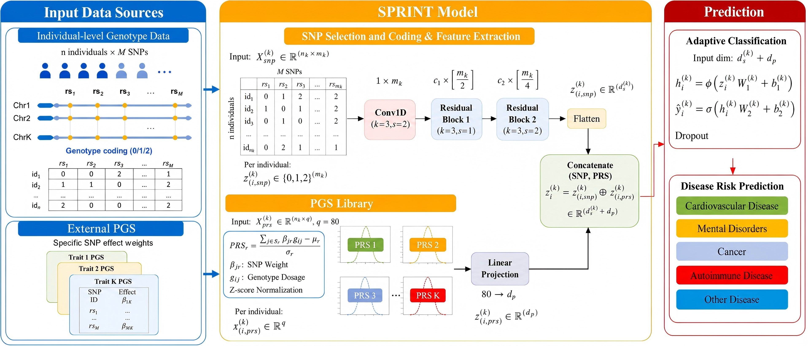
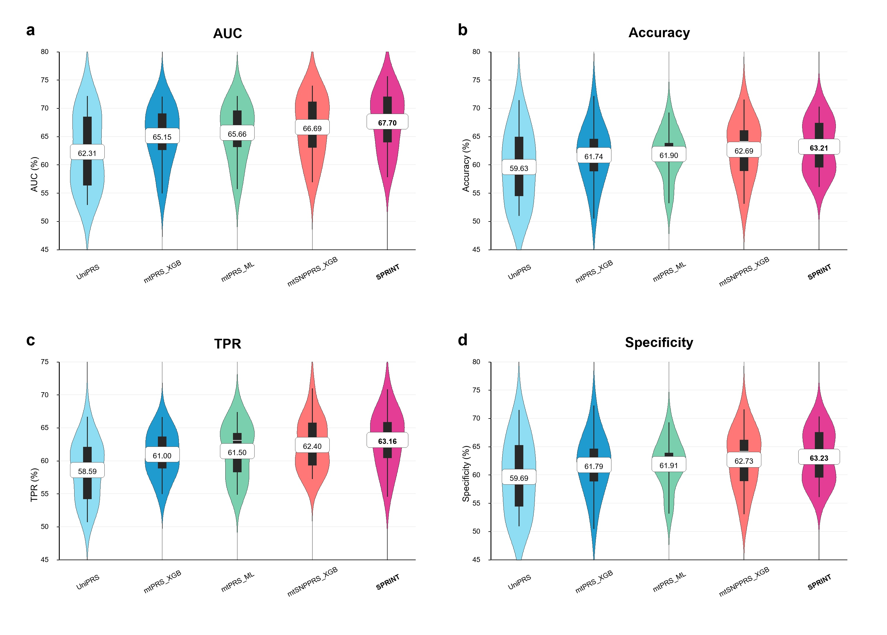

# SPRINT

SPRINT is a deep learning framework for complex disease genetic risk prediction using disease-specific SNP dosage features and multi-trait polygenic risk score (PRS) features.

## Overview

SPRINT trains a separate binary risk prediction model for each target disease. For a given disease, the model receives two inputs: a disease-specific SNP dosage matrix and a standardized multi-trait PRS matrix. The SNP branch uses a residual one-dimensional convolutional neural network to learn nonlinear SNP representations, while the PRS branch uses compact cross-trait genetic risk summaries. The two representations are fused and passed to an adaptive feed-forward classifier.

SPRINT was evaluated across 18 complex diseases in UK Biobank, including cardiovascular, neurological, cancer, autoimmune/inflammatory, and other disease categories.

## System Architecture

The following figure illustrates the overall architecture and workflow of SPRINT:



*Figure 1: SPRINT system architecture diagram, showing the workflow from disease-specific SNP features and multi-trait PRS features to disease-specific risk prediction.*

## Main Results

SPRINT achieved the best average and median AUC among the compared single-trait PRS, multi-trait PRS, and tree-based SNP-PRS baseline models.



*Figure 2: Overall performance comparison across 18 disease-specific prediction tasks.*

## Dependencies

- Python 3.9+
- PyTorch
- pandas
- scikit-learn
- numpy
- matplotlib
- seaborn
- xgboost
- shap
- tqdm
- PyYAML
- Pillow

## Installation

Clone the repository and install the required dependencies:

```bash
git clone https://github.com/labxscut/sxSPRINT.git
cd sxSPRINT
pip install -r requirements.txt
```

Alternatively, create a conda environment:

```bash
conda env create -f environment.yml
conda activate sprint
```

For GPU training, install a PyTorch build compatible with your CUDA version.

## File Structure

- `src/` - Core package containing SPRINT implementation
  - `model.py` - Residual SNP-PRS neural network architecture
  - `train.py` - Training and evaluation utilities
  - `metrics.py` - Binary classification metrics and threshold selection
  - `baselines.py` - Elastic net and XGBoost baseline utilities
  - `io.py` - CSV input loading and sample alignment utilities
- `configs/` - Example YAML configuration files
  - `example_config.yaml` - Input paths, training parameters, and output directory
- `data/` - Data access and input format instructions
  - `README.md` - Description of required SNP, PRS, and label matrices
- `figures/` - Main figures and public summary plots
- `results/` - Public summary-level performance results
- `scripts/` - Runnable public scripts
  - `generate_example_data.py` - Generate toy input CSV files
  - `train_sprint.py` - Train SPRINT from a YAML configuration file
  - `plot_summary_results.py` - Plot summary-level public results
  - `smoke_test.py` - Toy-array dependency and model test

## Usage

### 1. Run a quick smoke test

```bash
python scripts/smoke_test.py
```

This script initializes the SPRINT model, trains it briefly on randomly generated arrays, and reports validation metrics.

### 2. Generate example CSV data

```bash
python scripts/generate_example_data.py --out-dir data/example
```

This creates:

```text
data/example/snp.csv
data/example/prs.csv
data/example/labels.csv
```

### 3. Train SPRINT with a configuration file

```bash
python scripts/train_sprint.py --config configs/example_config.yaml
```

The script reads the paths and parameters from the YAML file, splits the data into training, validation, and test sets, selects the operating threshold on the validation set, and evaluates the final model on the held-out test set.

Default outputs are saved to:

```text
results/example_run/
├── metrics.json
├── test_predictions.csv
└── sprint_model.pt
```

### 4. Use your own data

Prepare three CSV files for each disease-specific task:

- SNP dosage file, for example `data/CAD/snp.csv`
- PRS feature file, for example `data/CAD/prs.csv`
- label file, for example `data/CAD/labels.csv`

Then update `configs/example_config.yaml`:

```yaml
data:
  snp_path: data/CAD/snp.csv
  prs_path: data/CAD/prs.csv
  label_path: data/CAD/labels.csv
  label_column: label

output:
  output_dir: results/CAD
```

Run:

```bash
python scripts/train_sprint.py --config configs/example_config.yaml
```

For multiple diseases, create one configuration file per disease and run the same command with the corresponding config.

### 5. Plot public summary results

```bash
python scripts/plot_summary_results.py
```

The output figure will be saved to:

```text
figures/summary_auc_from_public_results.png
```

## Input Format

SPRINT expects:

- `X_snp`: SNP dosage matrix with shape `(n_samples, n_snps)`
- `X_prs`: standardized multi-trait PRS matrix with shape `(n_samples, n_prs)`
- `y`: binary case-control labels with shape `(n_samples,)`

CSV files may include a `sample_id` column. If present, samples are aligned by `sample_id`. If absent, rows are aligned by order.

SNP dosage values should be encoded as 0, 1, or 2 according to the number of risk alleles. PRS features should be standardized before training.

## Model Usage

The core model is implemented in `src/model.py`:

```python
import torch
from src.model import SPRINT

model = SPRINT(
    snp_input_dim=X_snp.shape[1],
    prs_input_dim=X_prs.shape[1],
)

y_pred = model(
    torch.tensor(X_snp, dtype=torch.float32),
    torch.tensor(X_prs, dtype=torch.float32),
)
```

## Data Availability

This repository does not include individual-level UK Biobank genotype, phenotype, PRS, or prediction files.

The original study used UK Biobank data under approved application number 91090. Users should apply for access through UK Biobank and construct disease-specific SNP, PRS, and label matrices following the instructions in `data/README.md`.

Files such as raw genotype matrices, participant IDs, individual prediction files, `.pkl` matrices, `.npy` arrays, and model checkpoints are intentionally excluded.

## Output Format

Training outputs include:

- `metrics.json`: validation and held-out test metrics
- `test_predictions.csv`: sample ID, true label, predicted score, and binary prediction
- `sprint_model.pt`: trained PyTorch model weights

Model metrics include AUC, accuracy, true positive rate, specificity, MCC, AUPRC, and the selected probability threshold.

## Advanced Usage

The reusable modules are:

- `SPRINT` - Residual SNP-PRS neural network model
- `ResidualBlock1D` - Residual convolutional block for SNP features
- `train_one_model` - Training function with early stopping
- `evaluate_binary_metrics` - AUC and threshold-dependent metric calculation
- `elastic_net_classifier` and `xgboost_classifier` - Baseline model utilities

## Citation

If you use SPRINT in your research, please cite our paper:

```bibtex
@article{SPRINT2026,
  title={SPRINT: A SNP-PRS Residual Integration Model for Complex Disease Genetic Risk Prediction},
  author={Ren, Bozhen and Yu, Zhengyang and Li, Ziyan and Duan, Hongyu and Han, Xinyu and Ning, Kaida and Chen, Yangxin and Xia, Li C.},
  year={2026}
}
```

## License

This project is released under the MIT License.

## Contact

For questions, please contact:

Li C. Xia  
Department of Statistics and Financial Mathematics, School of Mathematics  
South China University of Technology  
Email: `lcxia@scut.edu.cn`
